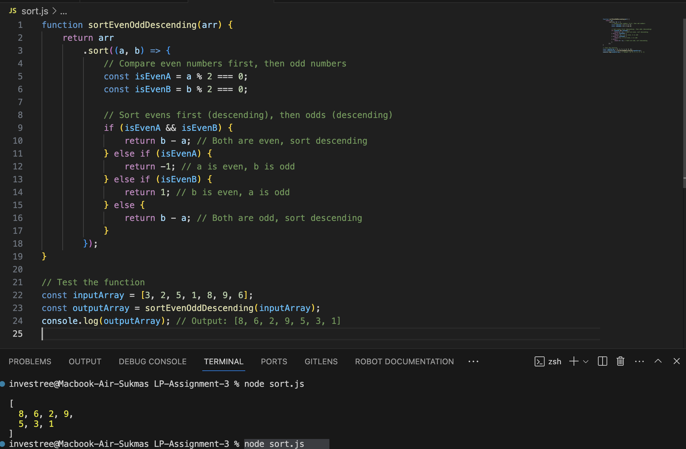

# Even-Odd Sorting Function
Hi I am Sukma and welcome to my project includes a reusable JavaScript function that sorts an array of integers such that even numbers come first in descending order, followed by odd numbers also in descending order.
input : [3,2,5,1,8,9,6]
output : [8,6,2,9,5,3,1]

## Functionality
- Given an input array of integers, the function returns a new array with the following characteristics:
  - All even numbers appear first, sorted in descending order.
  - All odd numbers follow, also sorted in descending order.

## Installation

1. Clone this repository:

    ```bash
    git clone https://github.com/andsukma/LP-Assignment-3.git
    ```
2. Navigate to the project directory:
    ```bash
    cd LP-Assignment-3
    ```

## Test Execution
To run tests, use the following command:
```bash
node sort.js
```
The result should be like this:
